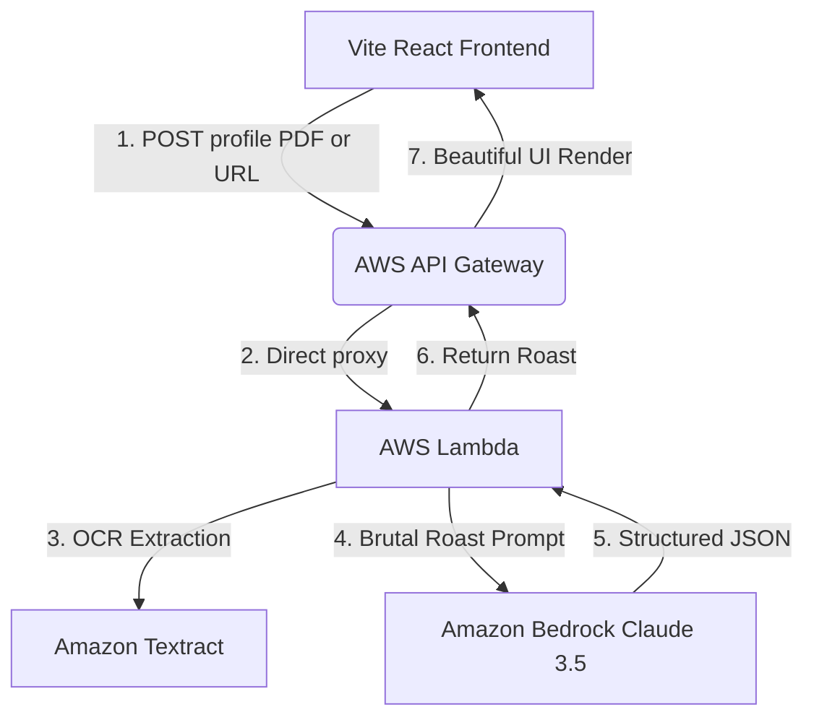

# AWS Deployment Guide: Hire Me or Roast Me 🔥

This sub-folder contains the production backend implementation for the "Hire Me or Roast Me 🔥" platform. Follow this step-by-step handbook to deploy the service to your AWS account.



---

## Technical Specifications & Requirements
- **Backend Runtime**: Node.js 18.x or Node.js 20.x Lambda environment.
- **Cognitive Layer**: Amazon Bedrock with Anthropic Claude 3.5 Sonnet access enabled.
- **OCR Engine**: Amazon Textract (integrated via standard SDK).
- **Hosting Layer**: AWS Amplify (recommended) or AWS S3 + CloudFront.

---

## Step 1: Request Amazon Bedrock Model Access
To run this application, you must enable model access for **Claude 3.5 Sonnet** in your AWS region:
1. Log in to the [AWS Management Console](https://console.aws.amazon.com/).
2. Navigate to **Amazon Bedrock** (ensure you are in `us-east-1` or `us-west-2` as Bedrock availability varies).
3. In the left panel, click **Model access**.
4. Click **Manage model access** in the top right.
5. Find **Claude 3.5 Sonnet** under the Anthropic column, check the box, and click **Save changes** to request access. Access is typically granted within 1–2 minutes.

---

## Step 2: Create the AWS Lambda Function
The Lambda function is the core controller handling OCR extraction via Textract and prompt submission to Bedrock.

1. Navigate to **AWS Lambda** and click **Create function**.
2. Select **Author from scratch**:
   - **Function name**: `HireMeOrRoastMe-Auditor`
   - **Runtime**: `Node.js 20.x`
   - **Architecture**: `x86_64` or `arm64` (recommended for lower cost)
3. Under **Change default execution role**, select **Create a new role with basic Lambda permissions**.
4. Click **Create function**.
5. Copy the code from [index.js](file:///Users/patelmaitry/Documents/HMRM/aws/lambda/index.js) into the Lambda index editor and click **Deploy**.

---

## Step 3: Configure IAM Permissions
Your Lambda needs permissions to talk to Textract and Bedrock.
1. In your Lambda dashboard, click the **Configuration** tab, then select **Permissions** on the left.
2. Click the link under **Role name** to open your execution role in the **IAM Console**.
3. Under the **Permissions policies** tab, click **Add permissions** -> **Create inline policy**.
4. In the JSON editor, paste the following policy:

```json
{
  "Version": "2012-10-17",
  "Statement": [
    {
      "Sid": "TextractPermission",
      "Effect": "Allow",
      "Action": [
        "textract:DetectDocumentText"
      ],
      "Resource": "*"
    },
    {
      "Sid": "BedrockPermission",
      "Effect": "Allow",
      "Action": [
        "bedrock:InvokeModel"
      ],
      "Resource": "arn:aws:bedrock:*::foundation-model/anthropic.claude-3-5-sonnet-20241022-v2:0"
    }
  ]
}
```
5. Click **Review policy**, name it `HMRM-Backend-Permissions`, and click **Create policy**.
6. **Increase Timeout**: Go back to the Lambda dashboard **Configuration** -> **General configuration**, click **Edit**, and change the timeout to **30 seconds** (as Bedrock responses can take a few seconds to stream). Click **Save**.

---

## Step 4: Expose via AWS API Gateway
1. Navigate to **API Gateway** and click **Create API**.
2. Under **HTTP API** (recommended for simplicity and low cost), click **Build**.
3. Configure the API:
   - **Integrations**: Choose **Lambda**, and select your `HireMeOrRoastMe-Auditor` function.
   - **API name**: `HMRM-API`
4. Click **Next** to proceed to **Configure routes**:
   - Set **Method** to `POST`.
   - Set **Resource path** to `/roast`.
   - Ensure the Integration target points to your Lambda function.
5. Click **Next**, **Next** (leave default stage `$default`), and click **Create**.
6. **Enable CORS**:
   - In the API Gateway sidebar, click **CORS**.
   - Under **Access-Control-Allow-Origin**, add `*` (or your specific frontend domain if hosted).
   - Under **Access-Control-Allow-Headers**, add `Content-Type,Authorization`.
   - Under **Access-Control-Allow-Methods**, add `POST,OPTIONS`.
   - Click **Save**.
7. Copy the **Invoke URL** from the API dashboard (e.g. `https://xxxxxx.execute-api.us-east-1.amazonaws.com`).

---

## Step 5: Configure and Deploy the Frontend
Now, update your client application to point to the newly deployed API.

### Local Development Test
Create a file named `.env.local` in your root folder:
```env
VITE_API_URL=https://your-api-gateway-id.execute-api.us-east-1.amazonaws.com
```
When you run `npm run dev`, your application will immediately bypass Mock Mode and leverage your actual live AWS Bedrock instance!

### Production Hosting with AWS Amplify
1. Push your React project code to GitHub or AWS CodeCommit.
2. Navigate to **AWS Amplify** in the console and click **New App** -> **Host web app**.
3. Connect your repository branch.
4. Amplify will automatically detect the Vite React structure. In the **Build Settings (Amplify Console)**, add the environment variable:
   - **Key**: `VITE_API_URL`
   - **Value**: `https://your-api-gateway-id.execute-api.us-east-1.amazonaws.com`
5. Click **Save and deploy**. Your website is now live!
